# Object Detection in an Urban Environment
 ## Goal

To classify and localize the cars, pedestrians and cyclists in camera input feed.

## Data

For this project, we will be using data from the [Waymo Open dataset](https://waymo.com/open/).


## Structure


### Data

The data we will use for training, validation and testing is organized as follow:
```
/home/workspace/data/
    - train: contain the train data 87 files
    - val: contain the val data 10 files
    - test - contains 3 files to test your model and create inference videos
```


## Local Setup

For local setup if you have your own Nvidia GPU, you can use the provided Dockerfile and requirements in the [build directory](./build).

Follow [the README therein](./build/README.md) to create a docker container and install all prerequisites.


### Download and process the data


**Note:** I used the Udacity Workspace, they already had the data processed ready to use.

The first goal of this project is to download the data from the Waymo's Google Cloud bucket to your local machine. For this project, we only need a subset of the data provided (for example, we do not need to use the Lidar data). Therefore, we are going to download and trim immediately each file. In `download_process.py`, you can view the `create_tf_example` function, which will perform this processing. This function takes the components of a Waymo Tf record and saves them in the Tf Object Detection api format. An example of such function is described [here](https://tensorflow-object-detection-api-tutorial.readthedocs.io/en/latest/training.html#create-tensorflow-records). We are already providing the `label_map.pbtxt` file.

You can run the script using the following command:
```
python download_process.py --data_dir {processed_file_location} --size {number of files you want to download}
```

You are downloading 100 files (unless you changed the `size` parameter) so be patient!


## Dataset


### Exploring dataset


| 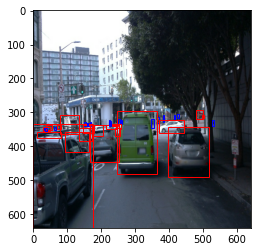  |  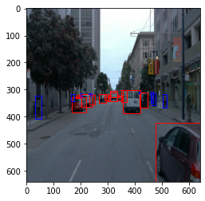 |
:-------------------------:|:-------------------------:
| 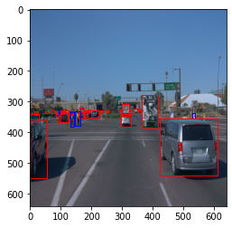  |  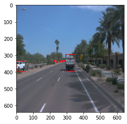 |


### Analysis


I have used random 10k samples from the dataset to analyse.


4. Distribution of class frequency in an image

   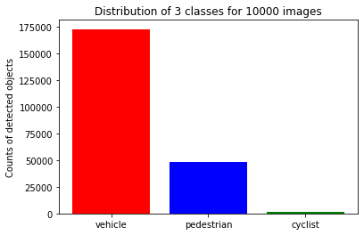


### Create the training - validation splits

Split the data into 87% train, 10% validation and 3% test.
Use the following command to run the script once your function is implemented:
```
python create_splits.py --data-dir /home/workspace/data
```

### The config file


The config that we will use for this project is `pipeline.config`, which is the config for a SSD Resnet 50 640x640 model. You can learn more about the Single Shot Detector [here](https://arxiv.org/pdf/1512.02325.pdf).

First, let's download the [pretrained model](http://download.tensorflow.org/models/object_detection/tf2/20200711/ssd_resnet50_v1_fpn_640x640_coco17_tpu-8.tar.gz) and move it to `/home/workspace/experiments/pretrained_model/`.

We need to edit the config files to change the location of the training and validation files, as well as the location of the label_map file, pretrained weights. We also need to adjust the batch size. To do so, run the following:
```
python edit_config.py --train_dir /home/workspace/data/train/ --eval_dir /home/workspace/data/val/ --batch_size 2 --checkpoint /home/workspace/experiments/pretrained_model/ssd_resnet50_v1_fpn_640x640_coco17_tpu-8/checkpoint/ckpt-0 --label_map /home/workspace/experiments/label_map.pbtxt
```
A new config file has been created, `pipeline_new.config`.


### Training


Model and training hyperparameters are defined using a file, pipeline_new.config.
You can make changes in this config file, then move the `pipeline_new.config` to the `/home/workspace/experiments/reference` folder. Now launch the training process:
* a training process:
```
python experiments/model_main_tf2.py --model_dir=experiments/reference/ --pipeline_config_path=experiments/reference/pipeline_new.config
```
Once the training is finished, launch the evaluation process:
* an evaluation process:
```
python experiments/model_main_tf2.py --model_dir=experiments/reference/ --pipeline_config_path=experiments/reference/pipeline_new.config --checkpoint_dir=experiments/reference/
```

**Note**: Both processes will display some Tensorflow warnings, which can be ignored. You may have to kill the evaluation script manually using
`CTRL+C`.

To monitor the training, you can launch a tensorboard instance by running `python -m tensorboard.main --logdir experiments/reference/`. You will report your findings in the writeup.
By default, the evaluation script runs for only one epoch. Therefore, the eval logs in Tensorboard will look like a blue dot.

### Augmentation

Explored the Object Detection API and applied many different augmentations. For instance, I observed that the dataset has a night image and decided to add a brightness augmentation


Used various augmentation strategies:
1. random_horizontal_flip
2. random_crop_image
3. random_adjust_contrast
4. adjust_gamma
5. random_adjust_brightness


| 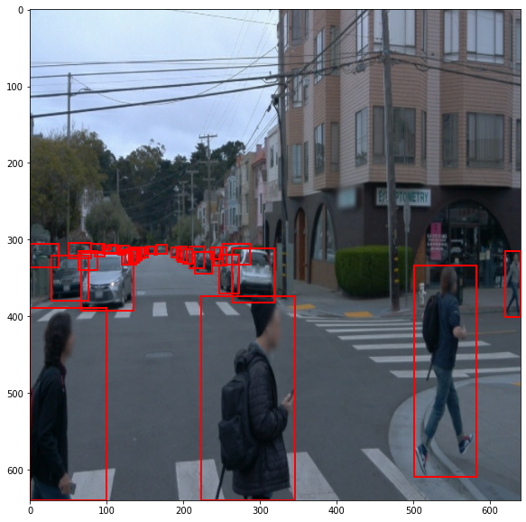  |  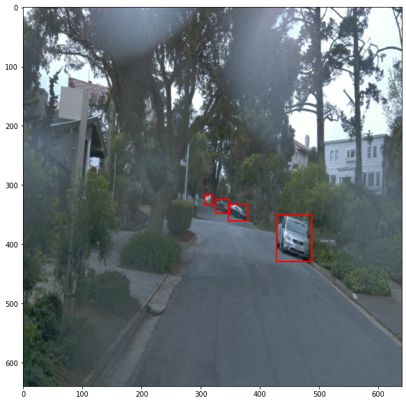 |
:-------------------------:|:-------------------------:
| 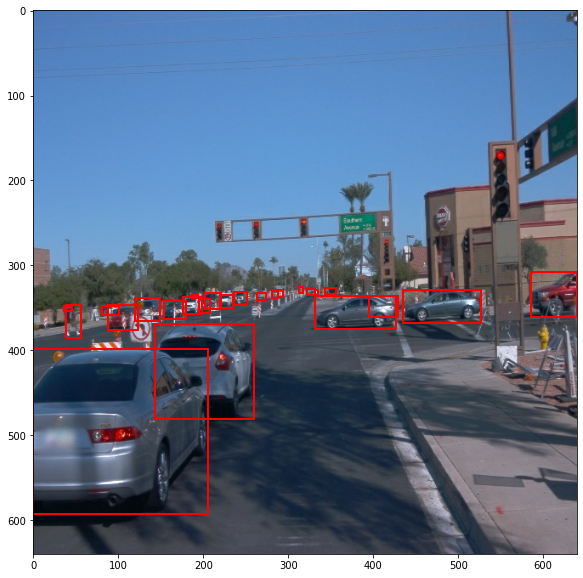  |  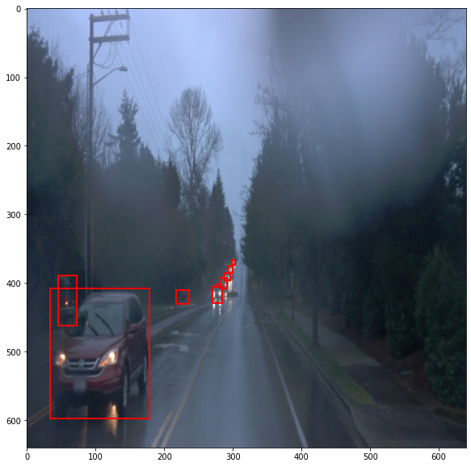 |


### Experiment
the loss is not decreasing fast enough and I experimented with a better learning rate. Hence, I used SGD with momentum. Rate decay: Cosine anealing with 
          -learning_rate_base: 0.0004
          -total_steps: 5000
          -warmup_learning_rate: 0.0004
          -warmup_steps: 330
 and total steps to 2900 to get the desired learning rate function.


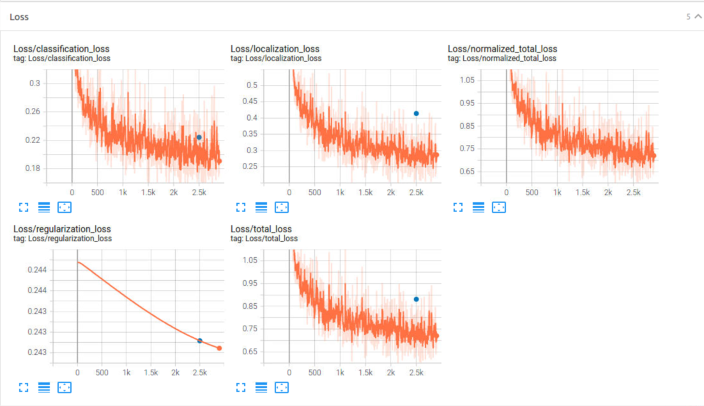


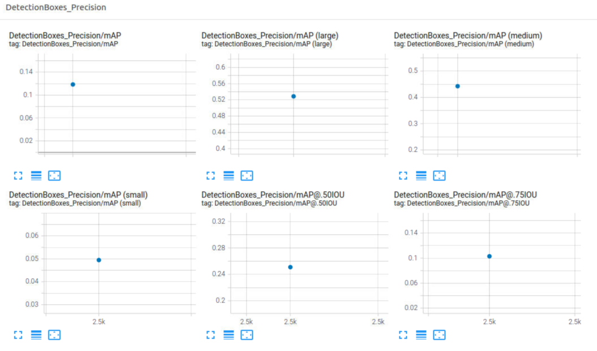


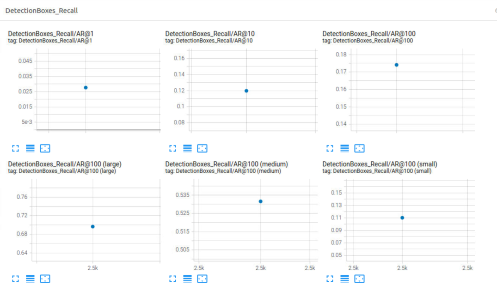


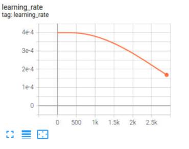

#### Export the trained model

Modify the arguments of the following function to adjust it to your models:

```
python experiments/exporter_main_v2.py --input_type image_tensor --pipeline_config_path experiments/reference/pipeline_new.config --trained_checkpoint_dir experiments/reference/ --output_directory experiments/reference/exported/
```

This should create a new folder `experiments/reference/exported/saved_model`. You can read more about the Tensorflow SavedModel format [here](https://www.tensorflow.org/guide/saved_model).

Finally, you can create a video of your model's inferences for any tf record file. To do so, run the following command (modify it to your files):
```
python inference_video.py --labelmap_path label_map.pbtxt --model_path experiments/reference/exported/saved_model --tf_record_path data/waymo/test/segment-12200383401366682847_2552_140_2572_140_with_camera_labels.tfrecord --config_path experiments/reference/pipeline_new.config --output_path animation.gif
```

## Test results


## Future Work

1.I observed of test animation, bounding box predictions are not stable in every frame (bounding box not detected for some cars in intermediate frames). One possible solution is to use  the pretrained model from [model zoo](https://github.com/tensorflow/models/blob/master/research/object_detection/g3doc/tf2_detection_zoo.md) such as EfficientDet D1 640x640.
2. More time can be spent on tune hyperparameters. Due to very limited compute resources, this could not be done.

